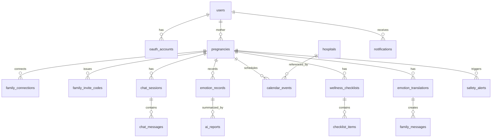

# 온맘(Onmom) MySQL DB 설계안

AI agent를 활용한 산모-가족 연결 서비스 **온맘**의 초기 DB 설계안입니다.

## 설계 기준

- DBMS: MySQL 8
- 백엔드: Spring Boot, JPA/Hibernate
- PK: `BIGINT AUTO_INCREMENT`
- 문자셋: `utf8mb4`
- 시간 타입: `DATETIME(3)`
- 삭제 정책: 기본 soft delete
- 제약조건 정책: PK, UNIQUE, INDEX는 유지하고 `FOREIGN KEY`, `CHECK`, MySQL `ENUM`은 사용하지 않음
- 코드값 정책: DB는 `VARCHAR`로 저장하고 Java enum/서비스 검증으로 관리

## 주요 테이블

| 테이블 | 목적 |
|---|---|
| `users` | 사용자 기본 정보 |
| `oauth_accounts` | 카카오 등 OAuth 계정 매핑 |
| `pregnancies` | 산모와 태아/임신 정보 |
| `family_connections` | 산모-가족 연결 관계 |
| `family_invite_codes` | 가족 연결용 6글자 초대 코드 |
| `hospitals` | 외부 지도 API 병원 정보 캐시 |
| `chat_sessions` | AI 채팅 세션 |
| `chat_messages` | AI 채팅 메시지 |
| `emotion_records` | 날짜별 감정 기록 |
| `ai_reports` | AI 생성 리포트 |
| `calendar_events` | 병원 예약 등 일정 |
| `wellness_checklists` | AI 추천 체크리스트 묶음 |
| `checklist_items` | 체크리스트 항목 |
| `emotion_translations` | 산모 감정의 AI 번역 결과 |
| `family_messages` | 가족에게 전달되는 메시지 |
| `safety_alerts` | 위험/주의 상황 알림 이벤트 |
| `notifications` | 사용자별 알림함 |

## ERD

## 권한 정책

### 산모

- 본인의 임신 프로필 생성/수정
- 본인의 감정 기록, AI 채팅, 일정, 체크리스트 생성/조회
- 가족 초대 코드 생성
- 연결된 가족 목록 조회/해제

### 가족

- `family_connections.status = 'CONNECTED'`인 산모 정보 일부 조회
- 산모가 공유한 메시지와 알림 조회
- 가족 메시지 읽음 처리
- 산모의 감정 기록, AI 채팅, 임신 정보 직접 수정 불가

## 삭제 정책

- 사용자 탈퇴 시 `users.status = 'DELETED'`, `users.deleted_at` 기록
- 가족 연결 해제 시 `family_connections.status = 'REVOKED'`
- 민감 데이터는 운영 정책에 따라 별도 보관 기간 후 삭제

## 인덱스 전략

| 조회 패턴 | 인덱스 |
|---|---|
| OAuth 로그인 | `oauth_accounts(provider, provider_user_id)` |
| 산모의 활성 임신 프로필 조회 | `pregnancies(mother_user_id, status)` |
| 가족 연결 조회 | `family_connections(family_user_id, status)` |
| 가족 초대 코드 입력 | `family_invite_codes(code)` |
| 산모의 활성 초대 코드 조회 | `family_invite_codes(pregnancy_id, status)` |
| 감정 캘린더 조회 | `emotion_records(pregnancy_id, record_date)` |
| 채팅 메시지 조회 | `chat_messages(session_id, created_at)` |
| 일정 조회 | `calendar_events(pregnancy_id, starts_at)` |
| 알림함 조회 | `notifications(user_id, read_at, created_at)` |

## 실제 DDL

- [V1__create_onmom_schema.sql](../src/main/resources/db/migration/V1__create_onmom_schema.sql)

## 구현 메모

- JPA에서는 DB 컬럼을 `VARCHAR`로 두고 Java `enum`과 `@Enumerated(EnumType.STRING)` 조합을 권장합니다.
- 카카오 로그인은 `oauth_accounts.provider = 'KAKAO'`, `oauth_accounts.provider_user_id = kakao.id` 조합으로 내부 사용자를 찾습니다.
- 신규 카카오 계정 로그인 시 `users`를 먼저 생성하고, 같은 트랜잭션 안에서 `oauth_accounts`를 생성합니다.
- `users.primary_role`은 현재 `MOTHER`, `FAMILY` 문자열 enum 값으로 관리합니다.
- `users.status`는 현재 `ACTIVE`, `DELETED` 문자열 enum 값으로 관리합니다.
- 가족 초대는 `family_invite_codes.code`에 저장된 6글자 코드로 처리합니다.
- `family_invite_codes.status`는 현재 `PENDING`, `REVOKED`, `EXPIRED` 문자열 enum 값으로 관리합니다.
- 초대 코드는 pregnancy당 활성 `PENDING` 코드 1개만 유지하고, 만료 전 여러 가족이 사용할 수 있습니다.
- 실제 가족 연결 결과와 중복 방지는 `family_connections(pregnancy_id, family_user_id)` 기준으로 관리합니다.
- DB `FOREIGN KEY`를 쓰지 않으므로 Service 레이어에서 참조 무결성을 검증해야 합니다.
- cursor 목록 조회 인덱스는 조회 조건 컬럼 뒤에 정렬 컬럼과 `id`를 함께 고려합니다. 기본 정렬은 `created_at DESC, id DESC`입니다.
- `chat_messages.metadata`는 AI 구조화 결과를 빠르게 저장하기 위한 JSON 필드입니다.
- 의료 조언과 관련된 메시지는 UI와 응답 템플릿에 고지를 함께 두는 것을 권장합니다.
